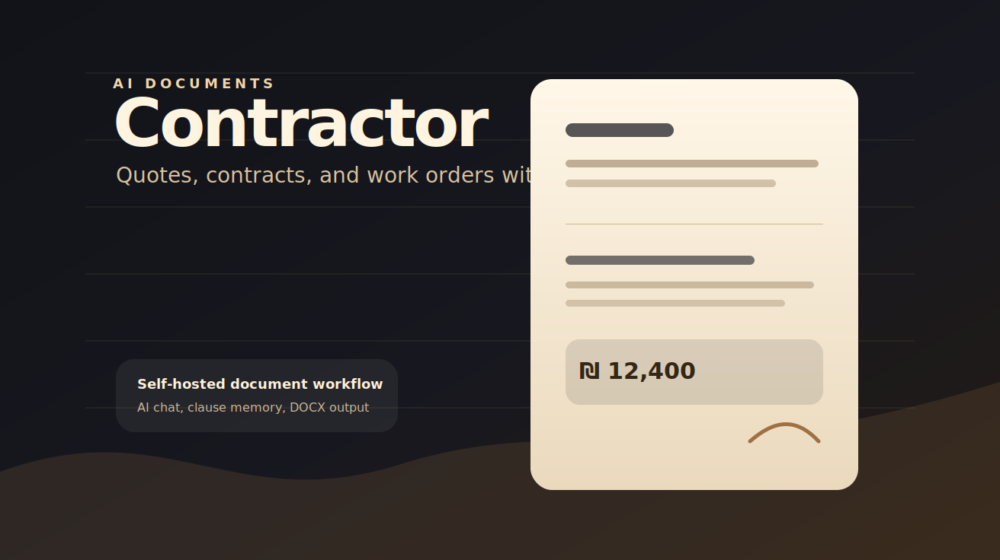

# Contractor



AI-powered document generator for freelancers. Create professional quotes, contracts, and work orders in minutes — with Hebrew RTL support built in.

[](LICENSE)
[](https://nodejs.org)

## Overview

Contractor is a self-hosted application for generating professional business documents. The AI chat assistant helps you draft quotes (הצעת מחיר), contracts (חוזה עבודה), and work orders (הזמנת עבודה) in both Hebrew and English.

**Key capabilities:**
- Generate DOCX documents with professional formatting
- Hebrew-first RTL layout with proper bidirectional text support
- AI-powered chat interface for guided document creation
- Smart clause database that learns from your existing contracts
- Multi-provider AI support (Anthropic, OpenAI, OpenRouter)
- Client and project management dashboard
- Dark/light theme

## MCP integration

Contractor can run as a standalone stdio MCP server without starting the web
application:

```bash
./contractor-linux-x64-v1.8.0.AppImage --mcp
```

Register the same executable for Codex App, Claude Desktop, and Antigravity 2:

```bash
node scripts/install-mcp-config.mjs \
  --executable=/absolute/path/to/contractor-linux-x64-v1.8.0.AppImage \
  --dry-run

node scripts/install-mcp-config.mjs \
  --executable=/absolute/path/to/contractor-linux-x64-v1.8.0.AppImage
```

The installer preserves other MCP servers, creates timestamped backups, and
updates Codex through `codex mcp add`. It detects existing Claude Desktop Linux
configurations. Antigravity 2 uses
`~/.gemini/antigravity/mcp_config.json`.

The MCP tools list clients and projects, read project drafts, import Markdown,
update drafts, and explicitly generate DOCX files. Draft writes never generate
documents automatically.

## Features

- **Dashboard** — View project stats, manage clients and documents at a glance
- **AI Chat** — Natural language guidance for filling out document forms
- **Clause Database** — 110+ Hebrew legal/business clauses with smart recommendations
- **Learn References** — Auto-extract clauses and patterns from your existing documents
- **Professional Output** — DOCX generation with Heebo fonts and modern styling
- **Multi-Provider AI** — Use Claude, ChatGPT, or OpenRouter models
- **Dark Mode** — Easy on the eyes, works offline-first where possible
- **Client Management** — Organize documents by client and project

## Quick Start

```bash
git clone https://github.com/endlessblink/contractor.git
cd contractor
npm run setup
npm start
```

The setup script installs dependencies, configures your AI provider, and initializes the clause database. Then open **http://localhost:6831** in your browser.

### Prerequisites

- Node.js 20 or later
- npm or yarn

### AI Provider Setup (Optional)

The app works with multiple AI providers. Configure in **Settings** (gear icon) at runtime:

**Anthropic (Default)**
- Get an API key from [console.anthropic.com](https://console.anthropic.com)
- Model: `claude-haiku-4-5-20251001` (recommended)

**OpenAI**
- Get an API key from [platform.openai.com](https://platform.openai.com)
- Model: `gpt-4o-mini` (recommended)

**OpenRouter**
- Get an API key from [openrouter.ai](https://openrouter.ai)
- Model: any slug, e.g. `anthropic/claude-3.5-sonnet`

**Claude Code OAuth** (No API key)
- If you have [Claude Code CLI](https://docs.anthropic.com/en/docs/claude-code) installed
- Run `claude login` in your terminal
- Enable in Settings → Use Claude Code OAuth

## Building Your Knowledge Base

The most powerful feature is the clause database. Here's how to populate it:

1. **Collect reference documents** — Gather your existing contracts, quotes, or work orders in a folder
2. **Access learn panel** — In the left sidebar, click the docs icon to open the documents panel
3. **Upload references** — Use "Learn from References" (למידה ממסמכי עזר) to upload your documents
4. **AI extraction** — The system automatically extracts clauses, templates, and payment patterns
5. **Use smart recommendations** — When creating new documents, the AI suggests relevant clauses based on what it learned

Each document you analyze strengthens the AI's understanding of your business terms and legal language. The clause database is stored in `knowledge/clauses-db.json` and grows with every reference document processed.

## Tech Stack

- **Backend** — Node.js with ES modules
- **Frontend** — Vanilla JavaScript (no build required for UI)
- **Documents** — `docx` npm package (DOCX generation)
- **Fonts** — Heebo (Hebrew primary) + Arial (fallback)
- **AI** — Multi-provider abstraction (Anthropic, OpenAI, OpenRouter)

## Configuration

Settings are stored in `data/user-profile.json` and can be edited via the UI or directly:

| Field | Description |
|-------|-------------|
| `name` / `nameEn` | Your name (Hebrew / English) |
| `company` | Company name |
| `title` / `titleEn` | Professional title |
| `email`, `phone`, `website` | Contact details for document footer |
| `logoPath` | Path to your logo file |
| `aiProvider` | `anthropic`, `openai`, or `openrouter` |
| `aiModel` | Model identifier (e.g., `claude-haiku-4-5-20251001`) |
| `aiApiKey` | Provider API key (if not using OAuth) |

## Project Structure

```
src/
  server.mjs              — Express backend + API routes
  generate-quote.mjs      — DOCX document generator
  ai-provider.mjs         — Multi-provider AI abstraction
  render-preview.mjs      — Document preview rendering
  shared/
    skills/               — AI output validation/formatting pipeline
    doc-skills/           — Document-specific formatting skills

public/
  index.html              — Single-page application (no build needed)
  js/                     — Generated bundles (skills pipeline, preview, etc.)

assets/
  logo.png                — Logo for document footer (customize this)
  fonts/                  — Heebo font files for DOCX generation

knowledge/
  clauses-db.json         — Hebrew business clause database (auto-generated)

data/
  user-profile.json       — Your settings (auto-created on first run)
```

## Commands

```bash
npm start                 # Start server on port 6831
npm run generate          # Generate a document from current form state
npm run build             # Build for standalone executable
npm test                  # Run test suite (if applicable)
```

## Building an Executable

Contractor can be packaged as a standalone executable for distribution:

```bash
npm run build             # All platforms (Linux, macOS, Windows)
npm run build:linux       # Linux x64
npm run build:mac         # macOS (both arm64 and x64)
npm run build:win         # Windows x64
```

Executables are built into `dist/executables/` and include all assets, fonts, and the clause database.

## License

MIT License — see [LICENSE](LICENSE) file for details.

## Premium Clause Pack (Coming Soon)

A curated Hebrew legal clause database specifically for Israeli freelancers will be available for purchase. Subscribe to updates on [the project repo](https://github.com/endlessblink/contractor).
